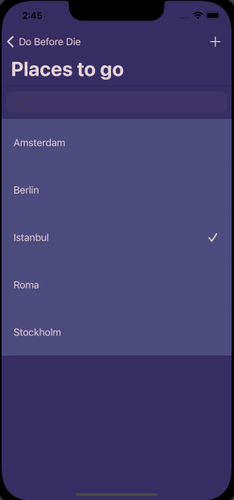
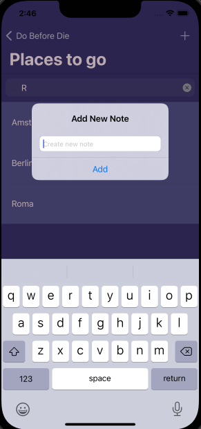
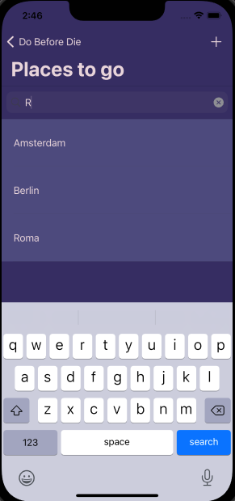
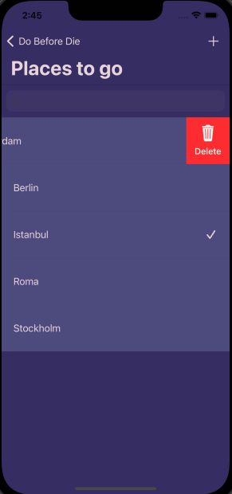

# Do-Before-Die
Simple note application using local realm database framework

## category list

## items of each category

## adding a new item alert

## searching an item from the list by ascending order (searching for contains)

## making the cell swipeable with pod

